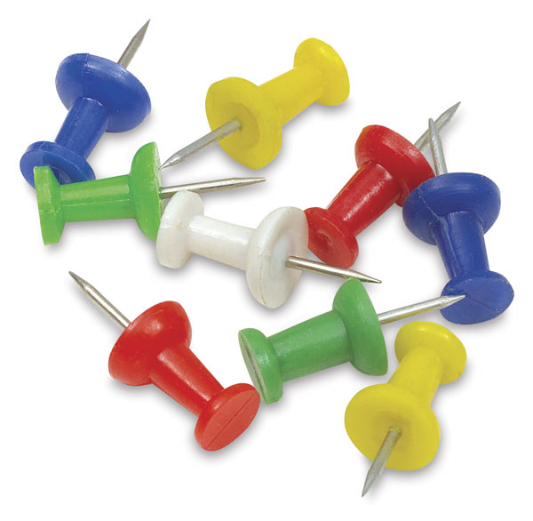
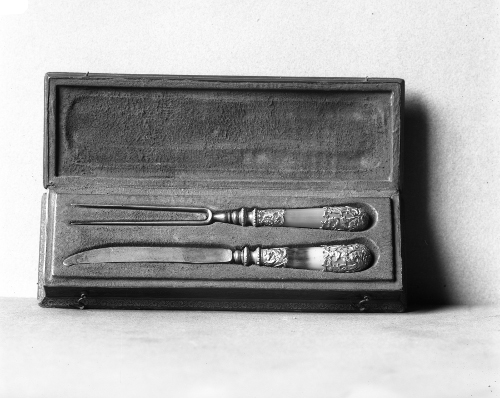

#HSLIDE
## Pattern Matching And Control Flow


#HSLIDE
## Да си преговорим!

 * Правим си проекти с mix
 * Програмите ни са модули, които съдържат функции
 * Основни типове


#HSLIDE
## Основни типове


#HSLIDE
### Числа
`Elixir` предлага цели числа и числа с плаваща запетая:

```elixir
1 # В десетична бройна система
#=> 1
10_000
#=> 10000
0x53 # В шестнадесетична
#=> 83
0o53  # В осмична
#=> 43
0b11 # В двоична
#=> 3
3.14 # С плаваща запетая
#=> 3.14
1.0e-10 # С плаваща запетая
#=> 1.0e-10
```

#HSLIDE
```elixir
1 + 41
#=> 42
21 * 2
#=> 42
54 / 6 # Връща резултат с плаваща запетая
#=> 9.0
Kernel.div(54, 6) # В повечето езици `/` прави това
#=> 9
Kernel.rem 11, 3 # А ето как получаваме остатъка.
#=> 2
```

#HSLIDE
```elixir
1 < 2
#=> true
1 >= 1
#=> true
1 != 2
#=> true
1 == 2
#=> false
1 == 1.0 # Операторът == сравнява по стойност
#=> true
1 === 1.0 # Операторът === сравнява по стойност И тип
#=> false
1 !== 1.0 # Операторът !== сравнява по стойност И тип
#=> true
```

#HSLIDE
### Булеви стойности: true/false

```elixir
true
#=> true
false
#=> false
Kernel.is_boolean(true)
#=> true
is_boolean(0)
#=> false
true == false
#=> false
```

#HSLIDE
### Атоми
* Атомите са константи, чието име е стойността им.
* Булевите стойности `true` и `false` всъщност са атомите `:true` и `:false`
* Имената на модули (колекции от функции и нещо повече) в `Elixir` също са атоми.
* Модули идващи от `Erlang` са реферирани от атоми.
* GC не ги събира.

#HSLIDE
### Атоми
* Удобни са за ползване като ключове в `map`-ове.
* Задължителна част от `keyword lists`.
* Често се използват в tuple-и за означаване на резултат от функция. Пример - ``{:ok, 2}``

#HSLIDE
### Атоми
* Освен ако не са в двойни кавички, атомите могат да съдържат подчертавки, цифри и латински букви, както и at(`@`).
* Атомите могат да завършват на `!` или на `?`.
* Идеални за pattern matching (съпоставянето им е еквивалентно на съпоставяне на числа)

#HSLIDE
```elixir
:atom
#=> :atom
:true
#=> true
SomeModule # Може и да не е дефиниран
#=> SomeModule
is_atom(:atom)
#=> true
is_atom(true)
#=> true
true == :true
#=> true
:"atom with a space" # Могат да се дефинират и така
#=> :"atom with a space"
```

#HSLIDE
### Низове
Низовете в `Elixir` се дефинират с двойни кавички и са с _UTF-8_ encoding:

#HSLIDE
```elixir
#=> "Здрасти"
"Здрасти"
#=> "Здрасти #{:Pesho}" # Интерполация
"Здрасти Pesho"
```

#HSLIDE
```elixir
is_binary("Здрасти")
#=> true
String.length("Здрасти") # Брой на символи
#=> 7
byte_size("Здрасти") # Брой на байтове
#=> 14
"Бял" <> " мерцедес!" # Конкатенация
#=> "Бял мерцедес!"
```

#HSLIDE
### Списъци
* Има специален модул, `List`, за работа с тях.
* Не държат стойностите си подредени в паметта.
* Намирането на дължината им, четене на стойност по index, добавяне на стойност на index и триене на стойност на index са все линейни операции.

#HSLIDE
```elixir
[1, 2, "три", 4.0] # Не са хомогенни
#=> [1, 2, "три", 4.0]
length [1, 2, 3, 5, 8] # Дължината
#=> 5
hd [1, 2, 3, 5, 8]
#=> 1
tl [1, 2, 3, 5, 8]
#=> [2, 3, 5, 8]
is_list([1, 2])
#=> true
'Еликсир' # Списък от unicode codepoint-и
#=> [1045, 1083, 1080, 1082, 1089, 1080, 1088]
[83, 79, 83]
#=> 'SOS'
```

#HSLIDE
### Кортежи


#HSLIDE
### Кортежи
* Кортежите съхраняват елементите си подредени един след друг в паметта.
* Достъпът до елемент по индекс и взимането на дължината им са константни операции.

#HSLIDE
### Кортежи
* Заедно с атомите за връщане на множество стойности от функция.
* За `pattern matching` - ще видим малко по-долу.
* Read-only колекция, защото писането в тях е скъпа операция.

#HSLIDE
```elixir
{:ok, 7}
#=> {:ok, 7}
tuple_size({:ok, 7, 5})
#=> 3
is_tuple({:ok, 7, 5})
#=> true
```

#HSLIDE
### Keyword lists
Списъци, които съдържат `tuple`-и от по два елемента - атом и каквато и да е стойност.

#HSLIDE
```elixir
[{:one, 1}, {:two, 2}]
#=> [one: 1, two: 2]
[one: 1, two: 2]
#=> [one: 1, two: 2]
```

#HSLIDE
* Ако keyword list е последен аргумент на функция, можем да пропуснем квадратните скоби при извикване:
```elixir
f(1, 2, three: 3, four: 4)
```

#HSLIDE
* Ключовете им могат да се повтарят.
* Използват се и за предаване на command line параметри или опции на функции.
* Пример е `String.split/3`.
```elixir
String.split("one,two,,,three,,,four", ",", trim: true)
#=> ["one", "two", "three", "four"]
```

#HSLIDE
### Maps
* Колекции от ключове и стойности.
* `Map`-овете в `Elixir` не позволяват еднакви ключове.
* За ключове може да се използва всичко и дори няма нужда да бъдат един и същи тип,
но обикновено се използват низове или атоми.

#HSLIDE
### Бинарен тип (Binaries)
Прдставляват поредици от битове и байтове.
```elixir
<< 2 >> # Цялото число 2 в 1 байт
#=> <<2>>
byte_size << 2 >>
#=> 1
<< 255 >> # Цялото число 255 в 1 байт
#=> <<255>>
<< 256 >> # Превърта и става 0
#=> <<0>>
<<1, 2>> # Две цели числа в два байта.
#=> <<1, 2>>
byte_size << 1, 2 >>
#=> 2
```

#HSLIDE
```elixir
<< 5::size(3), 1::size(1), 5::size(4) >>
#=> <<181>>
0b10110101
#=> 181
byte_size << 5::size(3), 1::size(1), 5::size(4) >>
#=> 1
is_bitstring << 5::size(3), 1::size(1) >>
#=> true
is_binary << 5::size(3), 1::size(1) >>
#=> false
```

#HSLIDE
* Интересен факт - низовете в `Elixir` са имплементирани като `binary` тип.
* Спомняте си че `is_binary("Стринг")` връщаше `true`.
```elixir
<<208, 170, 208, 156>> = "ЪМ"
#=> "ЪМ"
```

#HSLIDE
### Анонимни функции
```elixir
fn (x) -> x + 1 end
#=> #Function<6.52032458/1 in :erl_eval.expr/5>
(fn (x) -> x + 1 end).(4) # Извикване
#=> 5
is_function((fn (x) -> x + 1 end))
#=> true
```

#HSLIDE
```elixir
&(&1 + 1)
#=> #Function<6.52032458/1 in :erl_eval.expr/5>
(&(&1 + 1)).(4)
#=> 5
```

#HSLIDE
### Други типове
* Други типове са `Port`, `Reference` и `PID`, които се използват с процеси.
* Има и регулярни изрази. `~r/\w+/im`
* Ranges : `(1..1000)`
* Има различни shortcut-синтаксиси за дефиниране на някои от типовете.

#HSLIDE
## Съпоставяне на образци


#HSLIDE
## Съпоставяне на образци
* В Elixir `pattern matching`-a е еднa от най-важните и основни особености.
* Операторът `=` се нарича `match operator`.
* Можем да го сравним с знака `=` в математиката.

#HSLIDE
## Съпоставяне на образци
* Използвайки го, превръщаме целия израз в уравнение, в което сравняваме лявата с дясната страна.
* Ако сравнението е успешно се връща стойността на това уравнение, ако не - има грешка.

#HSLIDE
```elixir
x = 5
#=> 5
5 = x
#=> 5
4 = x
#=> ** (MatchError) no match of right hand side value: 1

```

#HSLIDE
#### Засега за `match operator`-а знаем:
1. С него могат да се дефинират променливи.
2. С него могат да се правят проверки - дали дадена променлива има дадена стойност.

#HSLIDE
* Имената на променливи задължително започват с малка латинска буква или подчертавка (`_`),
следвана от букви, цифри или подчертавки.
* Могат да завършват на `?` или `!`.
* Операторът `=` ще опита да присвои на всички възможни променливи от ляво стойности от дясно.

#HSLIDE
```elixir
{one, tWo, t3, f_our, five!} = {1, 2, 3, 4, 5}
#=> {1, 2, 3, 4, 5}
one
#=> 1
tWo
#=> 2
t3
#=> 3
f_our
#=> 4
five!
#=> 5
```

#HSLIDE
```elixir
[head|tail] = [1, 2, 4, 5]
#=> [1, 2, 4, 5]
head
#=> 1
tail
#=> [2, 4, 5]
[a, b|tail] = [1, 2, 4, 5]
#=> [1, 2, 4, 5]
a
#=> 1
b
#=> 2
tail
#=> [4, 5]
```

#HSLIDE
```elixir
g = fn
  0 -> 0
  x -> x - 1
end
#=> #Function<6.52032458/1 in :erl_eval.expr/5>
g.(0)
#=> 0
g.(3)
#=> 2
```

#HSLIDE


#HSLIDE
* В `Elixir` e възможно да променим стойността на променлива (не точно, но shadows!).
* В `Erlang` това не е възможно.

#HSLIDE
Ако искаме една променлива, която вече съществува да не промени стойността си при съпоставяне,
можем да използваме `pin` оператора - `^`.
```elixir
x = 5
#=> 5
^x = 6
#=> ** (MatchError) no match of right hand side value: 6
```

#HSLIDE
```elixir
{y, ^x} = {5, 4}
```

#HSLIDE
Ако се опитаме да присвоим стойност на `unbound` променлива (досега не е съществувала),
използвайки `pin` оператора, ще получим грешка.
```elixir
^z = 4
#=> ** (CompileError) iex:56: unbound variable ^z
```

#HSLIDE
#### Параметри на функции

```elixir
defmodule Example do
  def factorial(0), do: 1
  def factorial(n), do: n * factorial(n - 1)
end
```

#HSLIDE
#### Гардове

```elixir
defmodule Questionnaire do
  def how_old_are_you?(age) when age > 30 do
    "Имаме си чичко или леличка"
  end
  def how_old_are_you?(age) when age > 20 do
    "Имаме си милениалче, тригърнато от живота"
  end
  def how_old_are_you?(_), do: "Дете"
end

Questionnaire.how_old_are_you?(21)
#=> "Имаме си милениалче, тригърнато от живота"
```

#HSLIDE
## Control Flow


#HSLIDE
#### if / unless

```elixir
defmodule Questionnaire do
  def how_old_are_you?(age) do
    if age > 30 do
      "Имаме си чичко или леличка"
    else
      if age > 20 do
        "Имаме си милениалче, тригърнато от живота"
      else
        "Дете"
      end
    end
  end
end

Questionnaire.how_old_are_you?(33)
#=> "Имаме си чичко или леличка"
```

#HSLIDE
* Наше мнение е, че if е напълно ненужна конструкция в Elixir.
* Но има и още една, още по-ненужна - unless. <!-- .element: class="fragment" -->

#HSLIDE
* Стойността на `if` или на `unless` е стойността на израза, който се оценява.

```elixir
age = 34
name = "Пешо"

if age < 30 do
  "Младеж"
end
#=> nil

if age > 30, do: "Чичо #{name}", else: name
#=> "Чичо Пешо"
```

#HSLIDE
### Cond


#HSLIDE
* В 'cond' слагаме списък от условия, със свързан с тях код.
* Оценяват се докато стигнем до някое, което се оцени като true. <!-- .element: class="fragment" -->
* Когато това стане, се изпълнява асоциираният с него код и това е стойността на cond-a. <!-- .element: class="fragment" -->

#HSLIDE
```elixir
defmodule FizzBuzz do
  def of(n), do: Enum.map(1..n, &number_value/1)

  defp number_value(n) do
    cond do
      rem(n, 3) == 0 and rem(n, 5) == 0 -> "FizzBuzz"
      rem(n, 3) == 0 -> "Fizz"
      rem(n, 5) == 0 -> "Buzz"
      true -> n
    end
  end
end

FizzBuzz.of(17)
# [
#    1, 2, "Fizz", 4, "Buzz", "Fizz",
#    7, 8, "Fizz", "Buzz", 11, "Fizz",
#    13, 14, "FizzBuzz", 16, 17
# ]
```

#HSLIDE
* Обикновено последното условие на cond е 'true', за да има код, който да се изпълни,
* Ако не го сложим и нищо не се оцени като истина ще има грешка.

#HSLIDE
#### Специални форми
* За разлика от if, cond е 'специална форма'.
* Специалните форми са най-базовите градивни единици в Elixir.  <!-- .element: class="fragment" -->
* Не могат да се пренапишат от нас.  <!-- .element: class="fragment" -->
* Те са специални macro-си, които не са на написани на езика.  <!-- .element: class="fragment" -->

#HSLIDE
* Конструкциите if и unless са добавени за да се справи един императивен програмист с навлизането в Elixir.
* Но според нас са повече вредни, отколкото помагат. <!-- .element: class="fragment" -->
* Забравете че ги има. <!-- .element: class="fragment" -->
* Всъщност забравете и за cond.  <!-- .element: class="fragment" -->

#HSLIDE
### Case



#HSLIDE
```elixir
defmodule Questionnaire do
  def asl(age, sex, location) do
    case sex do
      :male ->
        "#{age}, М, #{location}"
      :female ->
        "#{age}, F, #{location}"
      _ ->
        "#{age}, LGBT, #{location}"
    end
  end
end

Questionnaire.asl(25, :female, "Ямбол")
#=> "25, F, Ямбол"
Questionnaire.asl(15, :male, "Софията, братле")
#=> "15, М, Софията, братле"
```

#HSLIDE
* Нужна е последна клауза, която match-ва всякакви стойности.
* Ако нищо не се match-не се изпълнява тази последна клауза.
* Ако я няма ще имаме грешка (CaseClauseError).

#HSLIDE
* Важно е да знаем, че case, също като cond е специална форма.
* Ползваме го само ако кодът ни стане прекалено разхвърлян или труден за разбиране с функции pattern matching. <!-- .element: class="fragment" -->
* Забравете за if и unless, по добре използвайте case. <!-- .element: class="fragment" -->

#HSLIDE
Защо case е по-добър избор пред cond?

* Проверките които правим в case, са свързани с data-та която му даваме.
* Лесно можем да собразим какво и защо проверяваме. <!-- .element: class="fragment" -->
* По-трудно да вкараме странични ефекти. <!-- .element: class="fragment" -->

#HSLIDE
* Проверките в cond могат да са всякакви и да са свързани с всякакви данни.
* Много по-лесно е да напишем код, в който се чудим кое от къде идва. <!-- .element: class="fragment" -->
* Много по-лесно е да имаме странични ефекти. <!-- .element: class="fragment" -->

#HSLIDE
### В заключение - нека никога не ползваме if, unless и cond. Никога.

#HSLIDE
### Конструкцията with

#HSLIDE
* Още една специална форма, която опростява писането на код.
* Това, което прави with е да комбинира множество успешни съпоставяния.
* Ако искаме няколко различни условия да са изпълнени за да направим нещо и ако само едно от тези условия не е изпълнено, да не го правим.

#HSLIDE
```elixir
defmodule HR do
  def work_experience(years) when years > 10, do: :experienced
  def work_experience(years) when years > 5, do: :advanced
  def work_experience(_), do: :not_experienced

  def knows_elixir?([]), do: false
  def knows_elixir?([:elixir, _]), do: true
  def knows_elixir?([_ | rest]), do: knows_elixir?(rest)

  def read_cv(file_path), do: File.read(file_path)
end
```

#HSLIDE

```elixir
years = 11
#=> 11

languages = [:erlang, :elixir, :rust]
#=> [:erlang, :elixir, :rust]

cv_path = "/tmp/cv.txt"

with :experienced <- HR.work_experience(years),
     true <- HR.knows_elixir?(languages),
     {:ok, cv} <- HR.read_cv(cv_path),
     do: cv
#=> "Some CV\n
```


#HSLIDE
Ако някое от условията не е изпълнено, ще получим стойността му:

```elixir
with :experienced <- HR.work_experience(3),
     true <- HR.knows_elixir?(languages),
     {:ok, cv} <- HR.read_cv(cv_path),
     do: cv
#=> :not_experienced
```

#HSLIDE
* Можем да правим още неща с with - погледнете документацията
* Погледнете и другите специални форми!

#HSLIDE
## Неизменимост


#HSLIDE
```elixir
base_list = [1, 2, 3]
#=> [1, 2, 3]
new_list = [0 | base_list]
#=> [0, 1, 2, 3]
```

#HSLIDE
## Това беше за днес.

